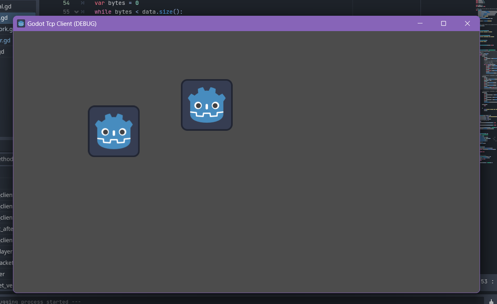

# Multiplayer_Server

## Backend 
### Multiplayer server with EPOLL API - C++ 

## FrontEnd 
Godot Endgine 

## Protocol 
### Client -> Server
Input Protocol 
- input(1byte) - slot_id(4byte) - velocity_x(4byte float) - velocity_y(4byte float) 

### Server -> Client 
State - 게임내 클라이언트의 입력값 처리 결과를 전송 
- state(1byte) - slot_id(4byte) - velocity_x(4byte float) - velocity_y(4byte float) 
slot_id(4byte) - velocity_x(4byte float) - velocity_y(4byte float) ... 

AssignId - 플레이가 처음 접속했을 떄 자신의 ID와 위치를 받음
- assignid(1byte) - slot_id(4byte) - position_x(4byte) - position_y(4byte) 

JoinPlayer - 다른 플레이어가 접속했음을 현재 접속한 플레이어에게 알림 
- joinplayer(1byte) - slot_id(4byte) - position_x(4byte) - position_y(4byte) 

LeavePlayer - 다른 플레이어가 연결을 끊었음을 현재 접속한 플레이어에게 알림 
- leaveplayer(1byte) - slot_id(4byte) 

## Image 

